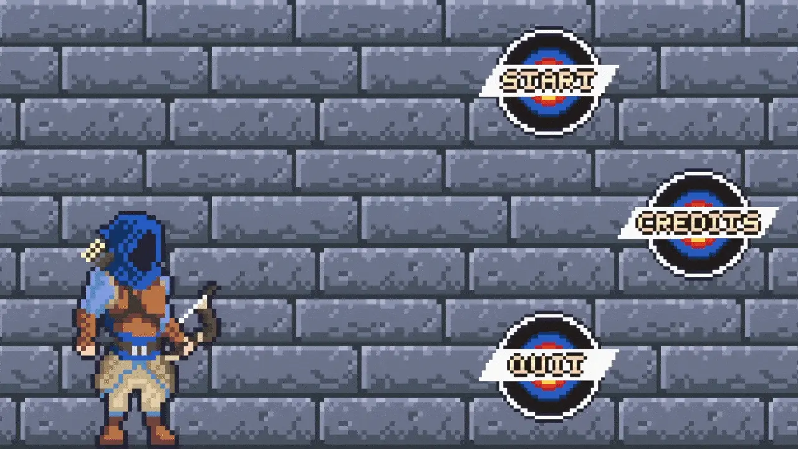
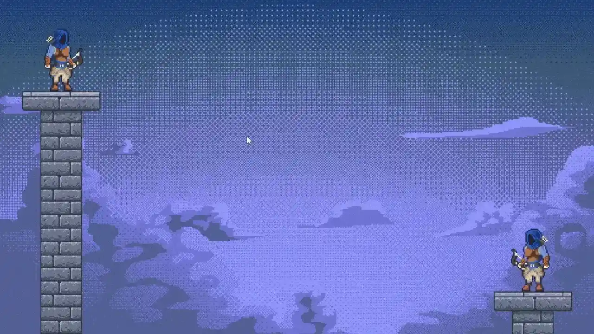

# Arche_rs

## Introduction

<b>Arche_rs</b> is a 2D game written in Rust programming language, where you control an archer and your goal 
is to beat up another archer controlled by AI in a bow battle. It was made as an university assignment
for <b>Rust programming</b> and <b>AI in computer games</b> classes.

## Features

* ECS based gameplay mechanics
* Interactive menu
* Bow shooting combat with projectile movement
* Neural network controlled AI trained with a genetic algorithm
  * Enemy adapts well to tower positions that change every round
  * Pre-trained network is being loaded from a file
* Simple collision detection
* Damage system
* Sprite animations
* Mouse controls

## Technologies

* [Rust](https://www.rust-lang.org/)
* [Bevy](https://bevyengine.org/)

## Requirements

* [Cargo](https://doc.rust-lang.org/cargo/)